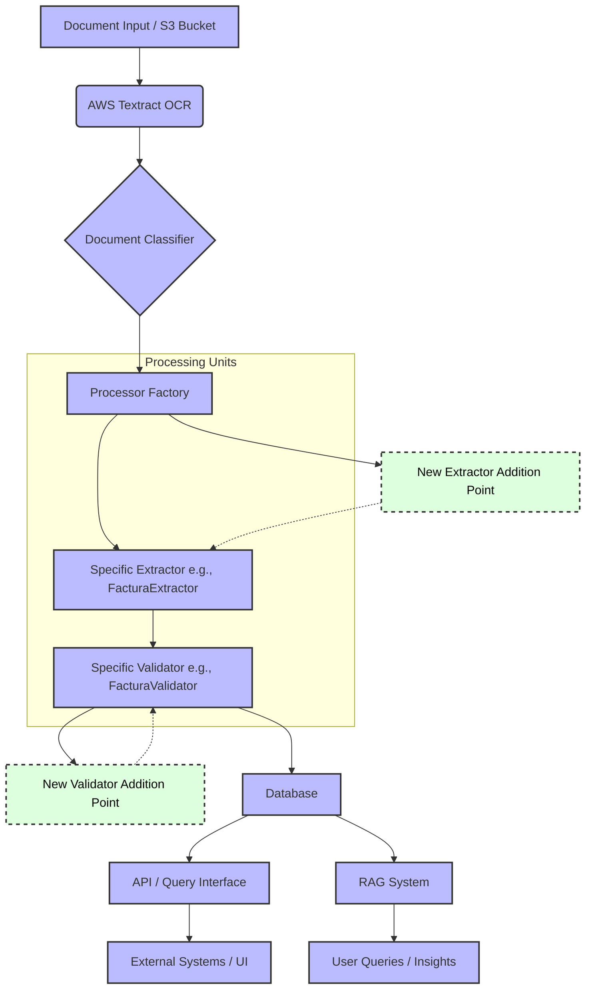

# fantastic-octo-computing-machine

## 1. Project Overview

`fantastic-octo-computing-machine` is a document processing system designed to automatically extract information from various types of documents, validate this information, and store it for further use. It leverages AWS Textract for Optical Character Recognition (OCR) and a modular architecture to support different document formats and custom processing logic.

## 2. Core Components

The system is organized into several key modules:

*   **`aws_lib/`**: Contains utility functions for interacting with AWS services.
    *   `s3.py`: Functions for S3 bucket operations (though not directly used by `BaseExtractor` for text loading, which uses `boto3` via `aws_lib.textract`).
    *   `textract.py`: Handles text extraction from documents stored in S3 using AWS Textract.
*   **`document_processor/`**: The main application logic resides here.
    *   **`base/`**:
        *   `base_extractor.py`: Defines the `BaseExtractor` abstract class, which all specific document extractors must inherit from.
        *   `base_validator.py`: Defines the `BaseValidator` abstract class, which all specific document validators must inherit from.
    *   **`classifier.py`**: (Assumed functionality) Responsible for determining the type of a document based on its content.
    *   **`config.py`**: Stores system-wide configurations, such as logging settings, AWS region, and potentially paths or parameters for different document types.
    *   **`db/`**: Manages database interactions.
        *   `database.py`: (Assumed) Contains database connection setup.
        *   `insert.py`: (Assumed) Contains functions to insert processed data into the database.
        *   `models/`: Defines the database schema using SQLAlchemy or a similar ORM.
        *   `query.py`: (Assumed) Contains functions to query data from the database.
    *   **`extractors/`**: Contains specific extractor implementations for different document types (e.g., `certificado_final.py`, `facturas.py`).
    *   **`validators/`**: Contains specific validator implementations for different document types (e.g., `certificado_final_validator.py`, `facturas_validator.py`).
    *   **`processor_factory.py`**: A crucial component that maps document types to their respective extractor and validator classes. It provides a `get_processor` function to retrieve the correct processing tools.
    *   **`pipeline.py`**: Orchestrates the entire document processing flow from text extraction to validation and storage.
    *   **`main.py`**: (Assumed) The main entry point for running the document processing system.
    *   **`api.py`**: (Assumed) If present, this would define an API for interacting with the document processing system (e.g., uploading documents, retrieving processed data).
    *   **`utils/`**: Contains various utility functions for tasks like date manipulation, file operations, text processing, etc.
*   **`tests/`**: Contains integration or system-level tests.
*   **`document_processor/tests/`**: Contains unit tests for the components within the `document_processor` module.

## 3. System Architecture Diagram

This diagram illustrates the overall architecture of the document processing system, including the main components, data flow, and points for future extensions.



**Diagram Explanation:**

1.  **Document Input / S3 Bucket**: Source of documents.
2.  **AWS Textract OCR**: Performs text extraction.
3.  **Document Classifier**: Identifies the type of document.
4.  **Processor Factory**: Selects the appropriate extractor and validator based on the document type.
5.  **Processing Units (Extractor & Validator)**: Specific components that extract and validate data for a given document type.
    *   **New Extractor/Validator Addition Point**: Highlights where new custom extractors and validators can be integrated into the factory.
6.  **Database**: Stores extracted and validated data along with document metadata.
7.  **Consumers**:
    *   **API / Query Interface**: Allows external systems or UIs to access the processed data.
    *   **RAG System**: Potentially uses the stored data for Retrieval Augmented Generation tasks.
    *   **External Systems / UI**: Applications that consume data via the API.
    *   **User Queries / Insights**: End-users querying the RAG system or database for information.

## 4. Document Processing Workflow

The typical workflow for processing a document is as follows:

1.  **Document Upload**: A document is uploaded (e.g., to an S3 bucket).
2.  **Text Extraction (OCR)**: The `DocumentProcessingPipeline` (often via `aws_lib.textract`) extracts raw text from the document.
3.  **Classification**: The extracted text is analyzed by the `DocumentClassifier` to determine its type (e.g., "factura", "certificado_final").
4.  **Processor Selection**: The `processor_factory.get_processor` function is called with the document type and the extracted text. It returns a `DocumentProcessor` instance containing the appropriate extractor and validator.
5.  **Data Extraction**: The selected extractor's `extract()` method is called to pull specific fields from the raw text.
6.  **Data Validation**: The selected validator's `validate()` method is called with the extracted data to check its correctness and consistency against predefined rules.
7.  **Storage**: The original document metadata, raw text (or its path), extracted data, and validation results are stored in a database (e.g., using functions from `db.insert`).
8.  **Output**: The pipeline returns a structured representation of the processed document.

## 4. Configuration

The `document_processor/config.py` file is intended to hold general system parameters. This might include:

*   AWS settings (e.g., region, S3 bucket names).
*   Database connection strings.
*   Logging levels and formats.
*   Constants or thresholds used in extraction or validation logic.

Ensure this file is correctly configured for your environment.

## 6. Integrating a New Extractor

To process a new type of document, you'll need to create a custom extractor.

### 5.1. Create the Extractor Class

Create a new Python file in the `document_processor/extractors/` directory (e.g., `my_new_document_extractor.py`). In this file, define a class that inherits from `BaseExtractor`:

```python
# document_processor/extractors/my_new_document_extractor.py
from document_processor.base.base_extractor import BaseExtractor
# Import any other necessary utilities (e.g., regex, date parsing)
import re

class MyNewDocumentExtractor(BaseExtractor):
    def __init__(self, bucket_name: str, document_key: str):
        super().__init__(bucket_name, document_key)
        # self.text is now loaded by the parent class's _load_text_from_s3 method

    def extract(self) -> dict:
        """
        Extracts specific information from the document text.
        """
        extracted_data = {
            "document_type": "MyNewDocumentType", # Important for classification/routing
            "title": None,
            "date": None,
            "amount": None,
            # Add other fields relevant to your new document type
        }

        # Example: Extract a title using a simple regex
        title_match = re.search(r"Title:\s*(.*)", self.text, re.IGNORECASE)
        if title_match:
            extracted_data["title"] = title_match.group(1).strip()

        # Example: Extract a date (you might use more robust date parsing)
        date_match = re.search(r"Date:\s*(\d{2}/\d{2}/\d{4})", self.text)
        if date_match:
            extracted_data["date"] = date_match.group(1).strip()

        # ... implement more extraction logic for other fields ...

        return extracted_data

```

**Key points for `BaseExtractor` usage:**

*   The `__init__` method of your new extractor should call `super().__init__(bucket_name, document_key)`.
*   The `BaseExtractor`'s `__init__` method automatically calls `_load_text_from_s3()`, which uses `aws_lib.textract.extract_text_from_document` to fetch and store the document's text content in `self.text`.
*   The `extract()` method must be implemented. It should return a dictionary containing the extracted key-value pairs.

### 6.2. Implement Extraction Logic

Inside the `extract()` method, use string manipulation, regular expressions, or other parsing techniques to find and retrieve the required information from `self.text`.

## 7. Integrating a New Validator

After extracting data, it's often necessary to validate it.

### 6.1. Create the Validator Class

Create a new Python file in the `document_processor/validators/` directory (e.g., `my_new_document_validator.py`). Define a class that inherits from `BaseValidator`:

```python
# document_processor/validators/my_new_document_validator.py
from document_processor.base.base_validator import BaseValidator
# Import any necessary validation utilities (e.g., date checking)
from datetime import datetime

class MyNewDocumentValidator(BaseValidator):
    def __init__(self, data: dict):
        super().__init__(data)
        # self.data now holds the dictionary from the extractor

    def validate(self) -> dict:
        """
        Validates the extracted data.
        Returns a dictionary with validation status and details.
        """
        validation_results = {
            "is_valid": True, # Overall validity
            "details": {},    # Field-specific validation messages
            "errors": []      # List of error messages
        }

        # Example: Validate the 'title' field
        title = self.data.get("title")
        if not title or len(title) < 5:
            validation_results["is_valid"] = False
            validation_results["details"]["title"] = "Title is missing or too short."
            validation_results["errors"].append("Invalid title.")

        # Example: Validate the 'date' field
        date_str = self.data.get("date")
        if date_str:
            try:
                datetime.strptime(date_str, "%d/%m/%Y")
                validation_results["details"]["date"] = "Date format is valid."
            except ValueError:
                validation_results["is_valid"] = False
                validation_results["details"]["date"] = "Date format is invalid. Expected DD/MM/YYYY."
                validation_results["errors"].append("Invalid date format.")
        else:
            validation_results["is_valid"] = False
            validation_results["details"]["date"] = "Date is missing."
            validation_results["errors"].append("Missing date.")

        # ... implement more validation logic ...

        # If any error occurred, set overall validity to False
        if validation_results["errors"]:
            validation_results["is_valid"] = False

        return validation_results
```

**Key points for `BaseValidator` usage:**

*   The `__init__` method of your new validator should call `super().__init__(data)`, where `data` is the dictionary returned by your corresponding extractor.
*   The `validate()` method must be implemented. It should return a dictionary typically containing:
    *   `is_valid` (bool): Overall validity status.
    *   `details` (dict, optional): Field-specific validation messages or statuses.
    *   `errors` (list, optional): A list of specific error messages if validation fails.

## 8. Registering New Components

After creating your new extractor and validator, you must register them in the `PROCESSOR_MAPPING` dictionary within `document_processor/processor_factory.py`.

1.  **Import your new classes** at the top of `document_processor/processor_factory.py`:

    ```python
    # ... other imports ...
    from document_processor.extractors.my_new_document_extractor import MyNewDocumentExtractor
    from document_processor.validators.my_new_document_validator import MyNewDocumentValidator
    # ...
    ```

2.  **Add an entry to `PROCESSOR_MAPPING`**:
    Use a unique key for your new document type (this key will be used by the classifier or other parts of the system to identify the document type).

    ```python
    PROCESSOR_MAPPING = {
        "certificado_final": {
            "extractor": CertificadoFinalExtractor,
            "validator": CertificadoFinalValidator,
        },
        "factura": {
            "extractor": FacturaExtractor,
            "validator": FacturaValidator,
        },
        # ... other existing mappings ...
        "my_new_document_type_key": { # This key should match what your classifier identifies
            "extractor": MyNewDocumentExtractor,
            "validator": MyNewDocumentValidator,
        },
        # ...
    }
    ```

## 9. Running the System

The system is typically initiated through the `DocumentProcessingPipeline`. This could be triggered by:

*   A main script (`document_processor/main.py`) that monitors an S3 bucket or a queue for new documents.
*   An API endpoint (defined in `document_processor/api.py`) that accepts document uploads.

The pipeline will then use the classifier and the `processor_factory` to process the document with your newly integrated extractor and validator.

## 10. Testing

It is crucial to add tests for your new components:

*   **Extractor Tests**: Create tests in `document_processor/tests/` (e.g., `test_my_new_document_extractor.py`) to verify that your extractor correctly parses sample document texts. You might need to mock the S3 text loading if testing locally without live AWS access, or provide sample text directly.
*   **Validator Tests**: Create tests to ensure your validator correctly identifies valid and invalid data based on the rules you've implemented.

Refer to existing tests in `document_processor/tests/` for examples on how to structure your tests (e.g., `test_certificado_final.py`).

By following these steps, you can extend the `fantastic-octo-computing-machine` to support new document types and custom processing logic.
